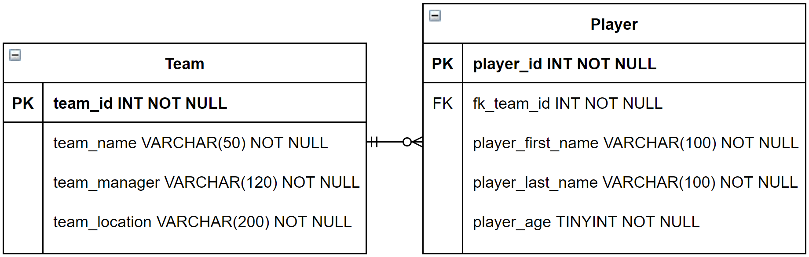
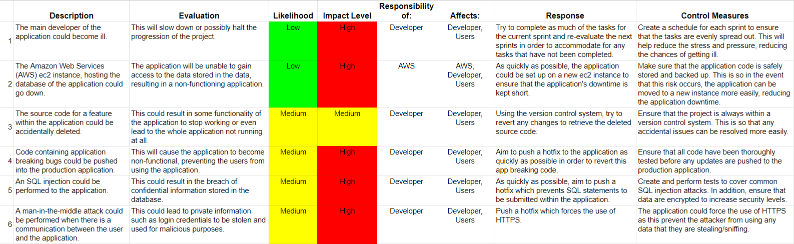
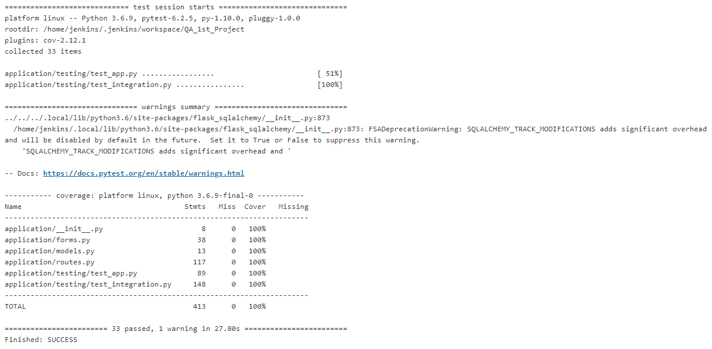

# DevOps Core Fundamental Project

## Project Objective
The main objective of this project is to create a CRUD application which incorporates all the supporting tools and technologies covered during training:

* Project Management
* Python Fundamentals
* Python Testing
* Git
* Basic Linux
* Python Web Development
* Continuous Integration
* Cloud Fundamentals
* Databases


## Database Design
For the database of the application, there are two main tables that are involved, as shown in the Entity Relationship Diagram below:



The Teams table has 4 total fields, with team_id being the Primary Key. As for the Player table, there are a total of 5 fields, where player_id is the Primary Key. In addition to this, the Player table has a Foreign Key named fk_team_id.
  
These two tables have a One-to-Many relationship, which is denoted by the link between the two tables shown in the diagram above. This relationship means that one team can have zero to many players, whilst one player can only ever have one team at any given time. This is vital as it ensures that the database accurately represents what typically occurs in the real world.


## Continuous Integration (CI) Pipeline


## Risk Assessment
This section looks into the possible risks that may arise during the development of the application.




## The Flask Application
### Running the Application
There are two main ways in which the application was run within the project, both of which are able to be run within the terminal:

1. Using normal Python: ``` python app.py ```
2. Using Gunicorn: ``` gunicorn --workers=4 --bind=0.0.0.0:5000 app:app ```

To ensure that the application is able to properly load up, these commands have to be run before running the application:

* Installing all required modules: ``` pip install -r requirements.txt ```
* Exporting the DATABASE_URI environment variable
* Exporting the SECRET_KEY environment variable
* Creating the database tables: ``` python create.py ```


### Read Operation
The first time that the application is opened, users will be shown the home page. This is where information about teams and their respective players will be displayed once they are created:

<!-- add image of the home page here -->

### Create Operation
In order to create a new team or a new player, the user can use the navigation bar, located at the top of the application, and click the "Add a Team" and "Add a Player" hyperlinks respectively.

Due to the relationship of the team and player tables, where a player record requires a team id, a user must first create a team record before being able to create a player record. To achieve this, the user can navigate to the "Add a Team" page where they will be shown the form:

<!-- add image of the add a team page here -->

Once the user has successfully made a new team record, the user can then navigate to the "Add a Player" page in order to create a new player record:

<!-- add image of the add a player page here -->


### Update Operation
In the event that the user wants to update details of a team or a player record that have already generated, the user can click the "Update a Team" and "Update a Player" respectively. Clicking on the "Update a Team" will display the form:

<!-- add image of the update a team page here (first page) -->

Once the user has selected the team they wanted to update, they are redirected to another page containing a form, allowing them to update the details of the chosen team:

<!-- add image of the update team details page (second page) -->

To update the details of a player record, the user can click on "Update a Player" where they will be shown a new page containing the form:

<!-- add image of update player page (first page) -->

After selecting the desired player they want to update, the user will then be redirected to a new page containing a form which allow them the ability to update the player's details:

<!-- add image of update player details -->


### Delete Operation
To delete a team or a player record, the user can click on the "Delete a Team" and "Delete a Player" located on the navigation bar. To delete a team, the user can click on the corresponding hyperlink and will be shown the page:

<!-- add image of delete a team page here -->

To delete a player record, the user can click on the "Delete a Player" where they will be shown the corresponding page:

<!-- add image of delete a player page here -->


## Unit and Integration Testing
To ensure that the application is functioning as expected all throughout the development process, unit and integration testing were performed. For this project, there were a total of 33 tests, consisting of 17 unit tests and 16 integration tests.

### Unit Testing
Unit testing's main priority is to test that each component of the application is functioning as expected. Therefore, the unit tests that were performed include:

* Testing that all the views (different webpages) load up within the application. Tests for this were carried out to ensure that all pages were accessible to the user, allowing them to navigate the application without issues.

* Testing the CREATE, READ, UPDATE and DELETE (CRUD) functionality of the application. This is important as this is the main objective of the project.

* Testing the custom form validators. This is to ensure that users are able to receive useful information in the event that an unsuccessful record submission has been made within the application.

### Integration Testing
Integration testing's main priority is to test that the application can continue to function optimally when different components of the application are started to be combined. To test this, the project uses Selenium in order to simulate a user interacting with the application. These tests includes:

* Testing the CREATE, UPDATE and DELETE operations of the application. The main purpose of these tests was to see that a user can navigate the application with ease and perform these operations without any issues. The READ operation was not tested as this was automatically performed by the application after a successful form submission.

* Testing the integrity of the different forms within the application. The main goal of these tests was to see whether the application can successfully handle unexpected form inputs from a user. This includes: entering a string value within an integer field, entering a number within a name field and injecting SQL statements within a form field.

### Testing Results
For all of the unit and integration tests, the Pytest tool was used throughout development to ensure that the application was operating as required. Initial testing were performed through the terminal. However, later in the development stage, the tests were performed within Jenkins along with the use of GitHub webhooks, which allow builds to be run after changes have been pushed to the project repository. Both of these methods were performed by running the command:

```
python -m pytest --cov=application/ --cov-report term-missing
```

Running this command will run both the unit and integration tests files and return a table showing the coverage of tests for each file within the specified directory, along with any lines that have not been tested/covered.

The image below shows the last successful build performed within Jenkins which includes a coverage report of the testing performed. From this, it can be seen that this build has achieved a coverage of 100%, with all 33 tests passing.



