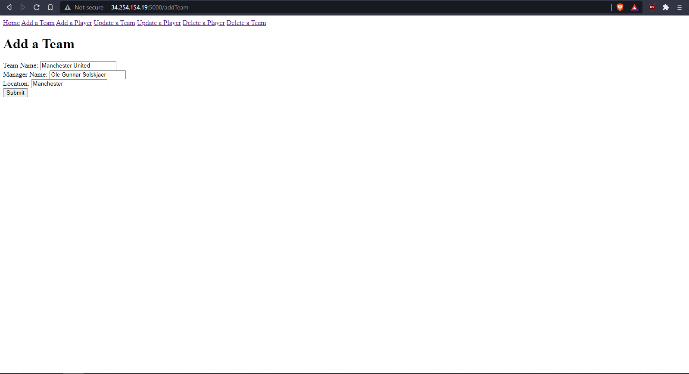
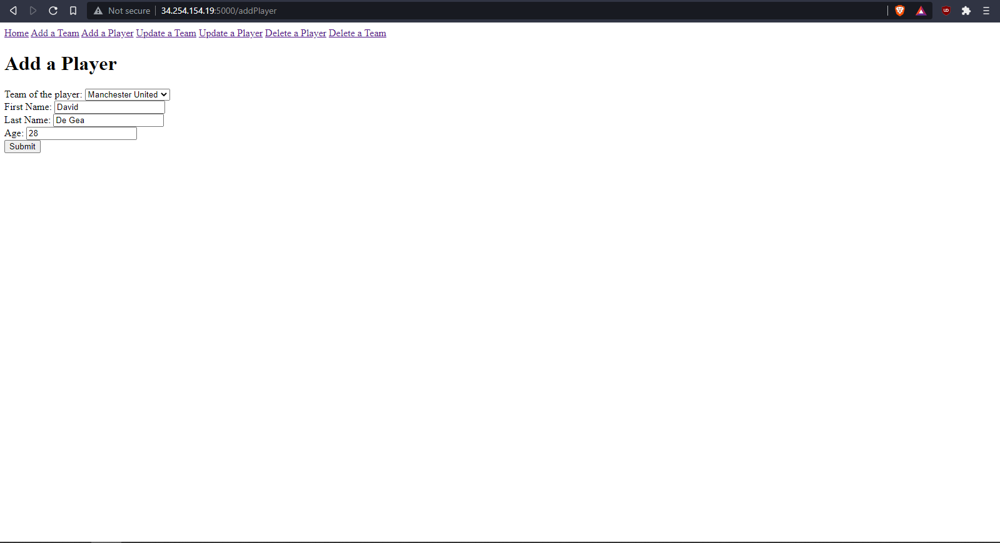
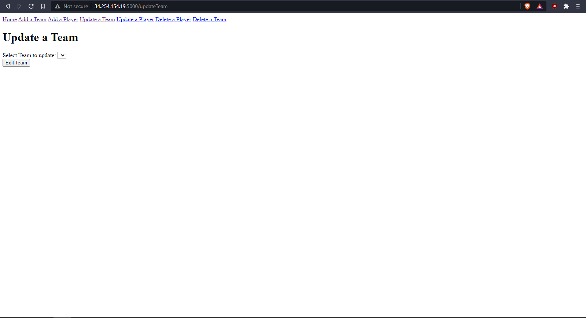
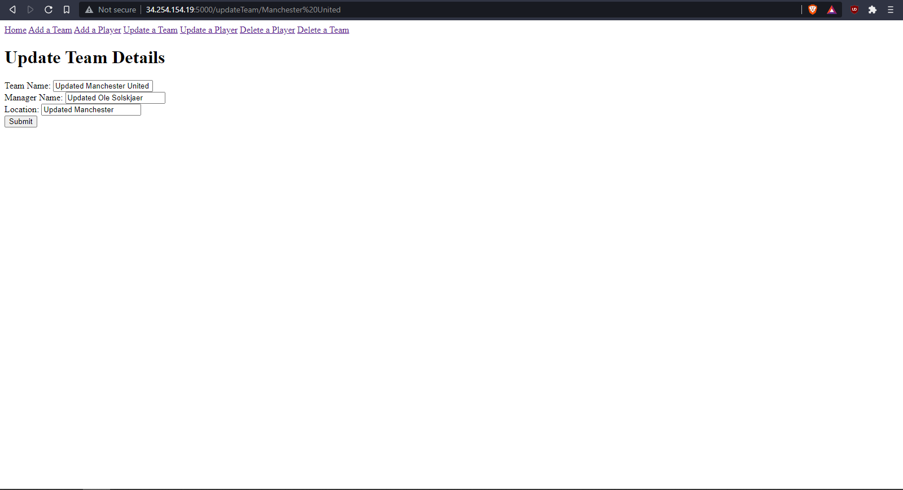
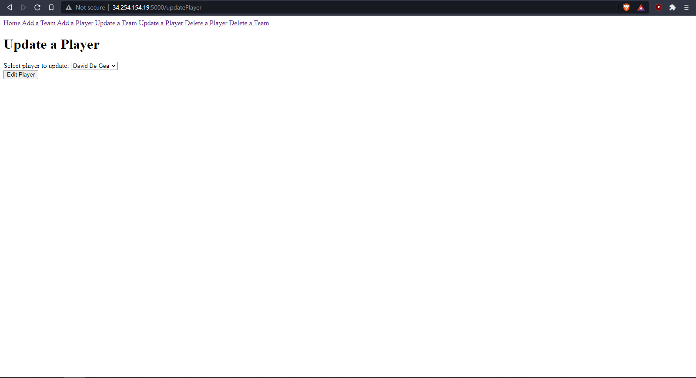
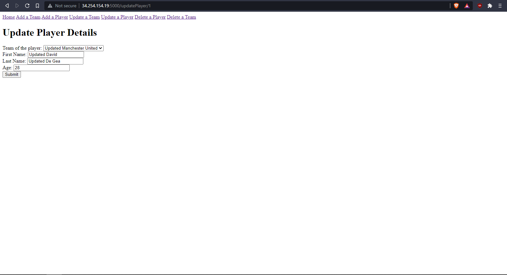
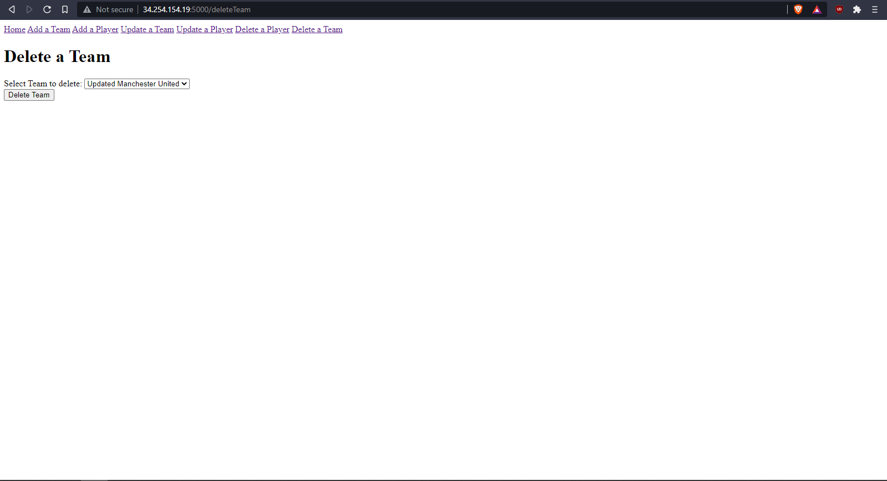
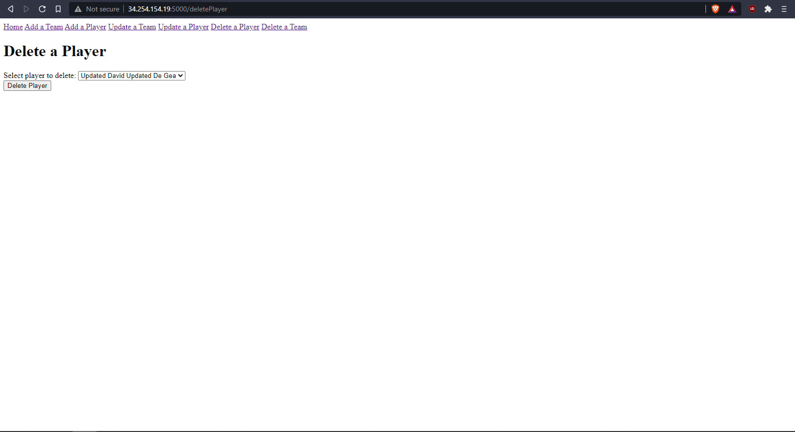

# DevOps Core Fundamental Project

## Useful Links
* Trello Board: [Click Here](https://trello.com/b/L9eDm4ez/1st-project)


## Contents
* [Project Objective](#Project-Objective)
* [Database Architecture](#Database-Architecture)
* [Continuous Integration (CI) Pipeline](#Continuous-Integration-Pipeline)
    * [Project Tracking](#Project-Tracking)
    * [Version Control Sytsem (VCS)](#Version-Control-System-(VCS))
    * [Cloud-Based Virtual Machine](#Cloud-Based-Virtual-Machine)
    * [Continuous Integration (CI) Server](#Continuous-Integration-(CI)-Server)
* [Risk Assessment](#Risk-Assessment)
* [The Flask Application](#The-Flask-Application)
    * [Running the Application](#Running-the-Application)
    * [Read Operation](#Read-Operation)
    * [Create Operation](#Create-Operation)
    * [Update Operation](#Update-Operation)
    * [Delete Operation](#Delete-Operation)
* [Unit and Integration Testing](#Unit-and-Integration-Testing)
    * [Unit Testing](#Unit-Testing)
    * [Integration Testing](#Interation-Testing)
    * [Testing Results](#Testing-Results)
* [Future Improvements](#Future-Improvements)
* [Authors](#Authors)


## Project Objective
The main objective of this project is to create a CRUD application which utilises the "supporting tools, methodologies and techonologies" that have been covered within training so far. 


## Database Architecture
For the database of the application, there are two main tables that are involved, as shown in the Entity Relationship Diagram below:


The Teams table has 4 total fields, with team_id being the Primary Key. As for the Player table, there are a total of 5 fields, where player_id is the Primary Key. In addition to this, the Player table has a Foreign Key named fk_team_id.
  
These two tables have a One-to-Many relationship, which is denoted by the link between the two tables shown in the diagram above. This relationship means that one team can have zero to many players, whilst one player can only ever have one team at any given time. This is vital as it ensures that the database accurately represents what typically occurs in the real world.


## Continuous Integration (CI) Pipeline
The CI pipeline provides the ability to maintain a single source code repository for a project. This means that everyone working on the project are all well informaed as to what is happening with th project. In addition to this, the CI pipeline allow for fast and smoother integration of new features as it promotes the automation of the integration process.

For this project, a continuous integration pipeline has been used for the benefits stated earlier, and the model used can be seen in the diagram below:


To keep track of the product backlog, the project utilises the Trello board as the main project tracking software. As for the code development, the project was developed using an Amazon Web Service (AWS) ec2 Linux instance, and the Python programming language was used.

Changes to the code are pulled from and pushed to the version control system, which for this project is utilising Git with GitHub.

As for the Continuous Integration Server, the project uses Jenkins as the main software. This tool is linked to the pipeline via webhook with GitHub. In the event that changes are pushed to GitHub, the webhook triggers a new Jenkins build which automates the testing of the application.

This automation process starts by Jenkins pulling the latest code repository from GitHub and is then passed to a build tool. From this, unit and integration testing are performed using Pytest and Selenium. Once the tests are completed, the coverage reports are then sent back where it is then displayed within the build history.

### Project Tracking
Trello
agile methodology


### Version Control System (VCS)
The version control system's main purpose is to track any changes that has been made to the codebase over time. To add to this, the VCS allow the application to be reverted to a stable state in the event that a newly pushed code breaks the application.

For this project, Git and GitHub was used as the main Version Control System. The main reasoning for this decision is due to the software's wide popularity, due to it being the largest open source repository, along with a wide variety of useful features.

### Cloud-Based Virtual Machine
For this project, an Amazon Web Services (AWS) ec2 instance was used in order to create the cloud-based virtual machine. The instance type is t2.medium and it was created to use Linux Ubuntu version 18.04. These settings were chosen for this project to ensure that tools such as Jenkins are able to be used without experiencing any issue.

This virtual machine was then used, alongside Python, in order to develop the application. Upon the completion of a task, new changes were then staged, commited and pushed into the GitHub repository. 

### Continuous Integration (CI) Server
Jenkins


## Risk Assessment
This section looks into the possible risks that may arise during the development of the application.


## The Flask Application
### Running the Application
There are two main ways in which the application was run within the project, both of which are able to be run within the terminal:

1. Using normal Python: ``` python app.py ```
2. Using Gunicorn: ``` gunicorn --workers=4 --bind=0.0.0.0:5000 app:app ```

To ensure that the application is able to properly load up, these commands have to be run before running the application:
* Crate a virtual environment: ``` python -m venv venv ``` then ``` source venv/bin/activate ```
* Installing all required modules: ``` pip install -r requirements.txt ```
* Exporting the DATABASE_URI environment variable
* Exporting the SECRET_KEY environment variable
* Creating the database tables: ``` python create.py ```


### Read Operation
The first time that the application is opened, users will be shown the home page. This is where information about teams and their respective players will be displayed once they are created:


### Create Operation
In order to create a new team or a new player, the user can use the navigation bar, located at the top of the application, and click the "Add a Team" and "Add a Player" hyperlinks respectively.

Due to the relationship of the team and player tables, where a player record requires a team id, a user must first create a team record before being able to create a player record. To achieve this, the user can navigate to the "Add a Team" page where they will be shown the form:



Once the user has successfully made a new team record, the user can then navigate to the "Add a Player" page in order to create a new player record:




### Update Operation
In the event that the user wants to update details of a team or a player record that have already generated, the user can click the "Update a Team" and "Update a Player" respectively. Clicking on the "Update a Team" will display the form:



Once the user has selected the team they wanted to update, they are redirected to another page containing a form, allowing them to update the details of the chosen team:



To update the details of a player record, the user can click on "Update a Player" where they will be shown a new page containing the form:



After selecting the desired player they want to update, the user will then be redirected to a new page containing a form which allow them the ability to update the player's details:




### Delete Operation
To delete a team or a player record, the user can click on the "Delete a Team" and "Delete a Player" located on the navigation bar. To delete a team, the user can click on the corresponding hyperlink and will be shown the page:



To delete a player record, the user can click on the "Delete a Player" where they will be shown the corresponding page:




## Unit and Integration Testing
To ensure that the application is functioning as expected all throughout the development process, unit and integration testing were performed. For this project, there were a total of 33 tests, consisting of 17 unit tests and 16 integration tests.

### Unit Testing
Unit testing's main priority is to test that each component of the application is functioning as expected. Therefore, the unit tests that were performed include:

* Testing that all the views (different webpages) load up within the application. Tests for this were carried out to ensure that all pages were accessible to the user, allowing them to navigate the application without issues.

* Testing the CREATE, READ, UPDATE and DELETE (CRUD) functionality of the application. This is important as this is the main objective of the project.

* Testing the custom form validators. This is to ensure that users are able to receive useful information in the event that an unsuccessful record submission has been made within the application.

### Integration Testing
Integration testing's main priority is to test that the application can continue to function optimally when different components of the application are started to be combined. To test this, the project uses Selenium in order to simulate a user interacting with the application. These tests includes:

* Testing the CREATE, UPDATE and DELETE operations of the application. The main purpose of these tests was to see that a user can navigate the application with ease and perform these operations without any issues. The READ operation was not tested as this was automatically performed by the application after a successful form submission.

* Testing the integrity of the different forms within the application. The main goal of these tests was to see whether the application can successfully handle unexpected form inputs from a user. This includes: entering a string value within an integer field, entering a number within a name field and injecting SQL statements within a form field.

### Testing Results
For all of the unit and integration tests, the Pytest tool was used throughout development to ensure that the application was operating as required. Initial testing were performed through the terminal. However, later in the development stage, the tests were performed within Jenkins along with the use of GitHub webhooks, which allow builds to be run after changes have been pushed to the project repository. Both of these methods were performed by running the command:

```
python -m pytest --cov=application/ --cov-report term-missing
```

Running this command will run both the unit and integration tests files and return a table showing the coverage of tests for each file within the specified directory, along with any lines that have not been tested/covered.

The image below shows the last successful build performed within Jenkins which includes a coverage report of the testing performed. From this, it can be seen that this build has achieved a coverage of 100%, with all 33 tests passing.


## Future Improvements
Moving on with the project, there are different things which could be implemented which will help progress the project. This includes:

* Providing more information for each player record such as: date of birth, position, shirt number, etc.
* Improving the aesthetics of the application to make it more interesting to look at. Doing so could also improve the readability of the application.
* Implementing the ability to click on a specific team which would redirect the user to a page with more information about the chosen team.
* Ability to classify teams into the specific league they are on, e.g. Manchester United will be placed in the Premier League category.

## Authors
Jason Antonino
